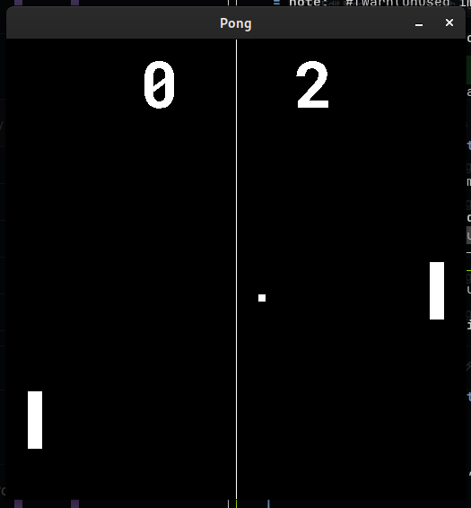

# pong-rs
The first game in the 20 games challenge, Pong but in Rust, for typesafe slow gameplay!

## Libraries
The main crate used is SDL2 - I decided to go a bit more direct with my 2D graphics programming
this time rather than use a heavy abstraction layer. That, and the other crates main boilerplate
looked really ugly and seemed like a pain to use. What really ticked me off is that SDL2 in Rust
returns Results with error type String, so I can't just use the ? operator to propogate it up the
functions into an anyhow handler, which is a bit miserable because I don't want to keep writing 
`.unwrap()` all the time.

## Gameplay
This is literally just Pong. Left Player uses W/S, Right uses Up/Down. Bounces are calculated
not with trigonometry but with a vector drawn from the centre of the paddle to the centre of the
ball using simple differences. This means the bounces may not look like how the average bounce 
should, but it gives players more control over where something bounces in an intuitive way.
The use of no trig means minimal performance gains, but its good to write about those so that I
sound smart. In addition, for every few paddle bounces, the speed of the ball increases by 1 which
means that gameplay ramps up quite fast in the end stages of a round. The ball, on reset, goes to 
a different player each round. This is calculated by checking whether the score sum is odd or even.

## Limitations
Sometimes, the collisions can get wacky with high speeds. I have eliminated all of the problems
that cause crashes, but it sometimes gets stuck wherever. Instead of fixing these, I just added
a reset button on R. Additionally, the code style can be a bit bad sometimes - there are parts 
that could have code repetition reduced with the use of macros or other functions. 

## Screenshots

